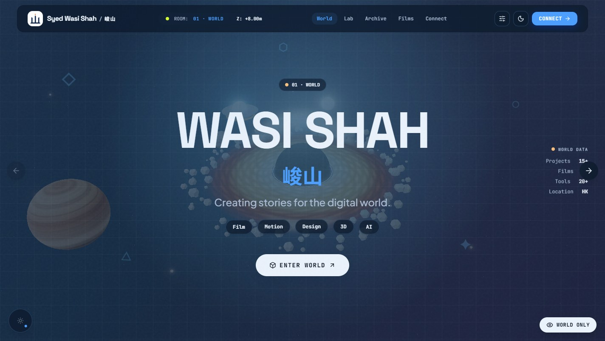
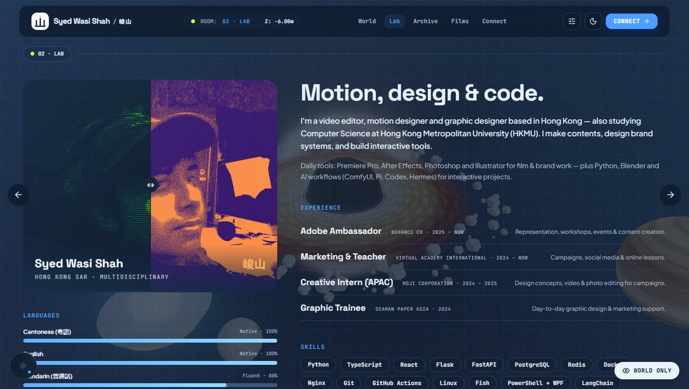
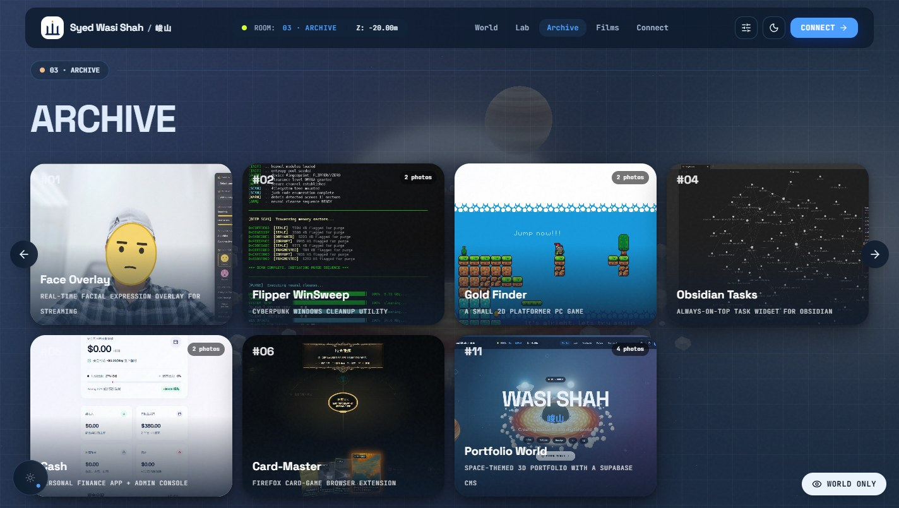
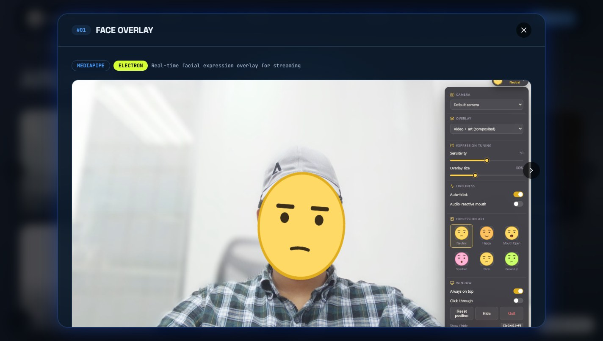
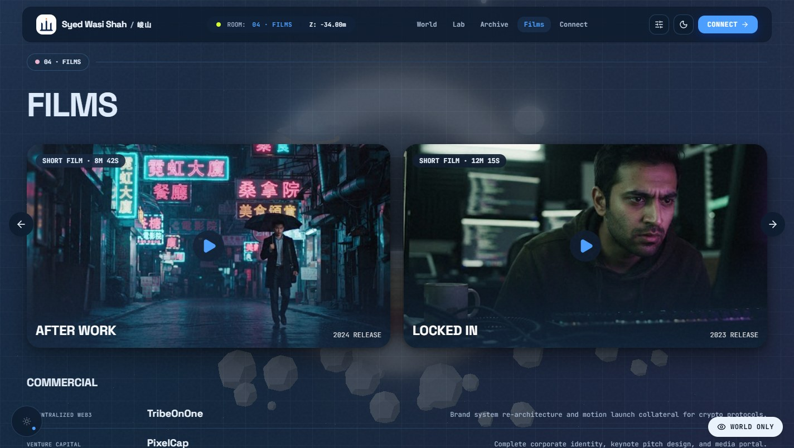
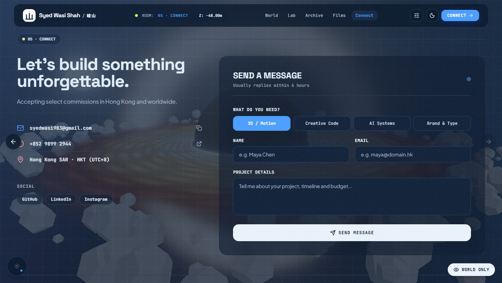
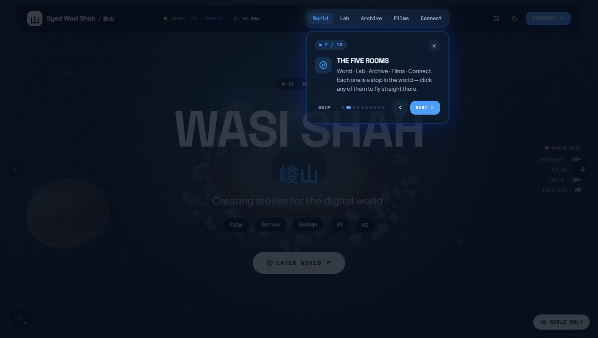
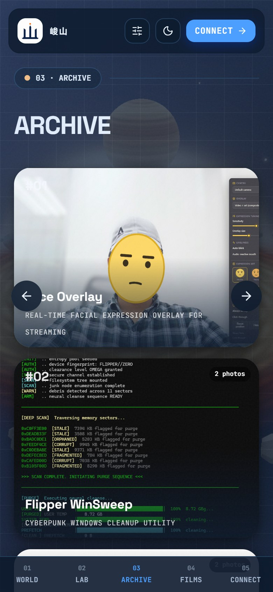

<div align="center">

# WASI SHAH / 峻山 · Digital World

**A space-themed 3D portfolio you travel through instead of scrolling.**

You don't scroll a page — you fly a camera through a WebGL universe, and five rooms wait at different depths along the way.

[](https://wasi-shah-portfolio.vercel.app/)


[](https://wasi-shah-portfolio.vercel.app/)

</div>

---

## Table of contents

- [The five rooms](#the-five-rooms)
- [Features](#features)
- [How it fits together](#how-it-fits-together)
- [Tech stack](#tech-stack)
- [Getting started](#getting-started)
- [The CMS](#the-cms)
- [Performance engineering](#performance-engineering)
- [Deploy](#deploy)
- [Scripts](#scripts)

---

## The five rooms

Instead of one long page, the site is a **corridor through space**. Scrolling moves the camera; each stop fades a room in over the world.

| | Room | What's there |
|---|---|---|
| **01** | **WORLD** | The hero — black hole with an accretion disk, planets, particle field, live "world data" |
| **02** | **LAB** | About, an interactive **ASCII duotone portrait**, experience timeline, skills, languages |
| **03** | **ARCHIVE** | Project cards → detail modals with galleries, *"how it's built"* ASCII diagrams and links |
| **04** | **FILMS** | Short films with video, commercial work, and Daily / Event photography grids |
| **05** | **CONNECT** | Contact form, socials, details |

<div align="center">

### 02 · Lab


### 03 · Archive


### 03 · A project, opened


### 04 · Films


### 05 · Connect


</div>

### First visit: a guided tour

A spotlight tour flies you to each room and highlights the **real** controls — it isn't a static carousel.

<div align="center">



</div>

### And it works on a phone



---

## Features

### The world
- Hand-built **WebGL scene** — black hole with accretion disk, ringed planet, drifting particle field, node constellation, bloom post-processing
- Scroll, arrow keys, the side arrows, the top nav, or the mobile bottom bar all **fly the camera** between rooms
- Rooms cross-fade and **glitch in** with an RGB-split entrance animation
- Drag the dial to aim the **ambient light**; move the mouse (or tilt your phone) to nudge the camera; click anywhere to send a **ripple** through space
- A **"World only"** toggle hides the entire site so you can just watch it

### Reading it
- Two themes: the **space world** (default) and a deeper **night mode** — manual toggle only, it never hijacks your OS setting
- **Background opacity** slider (default 25%) pushes the world back behind the text
- Fully responsive: mobile bottom nav, swipe navigation, safe-area handling
- Loading screen, cookie consent, privacy policy, error boundary and a 404 page

### The work
- **Projects** — multi-image galleries, per-image crop ratio and 9-point focal point, per-image captions, optional video, repo + live links, and a `ProjectDetails` renderer supporting headings, `◆` bullets and **fenced code blocks** (used for ASCII architecture diagrams)
- **Films** — posters plus YouTube-nocookie / Vimeo / self-hosted video
- **Photography** — Daily stills and Event stills grouped by event, with **before/after** comparison sliders
- Full-screen **lightbox** — prev/next, keyboard, swipe, `1/N` counter
- **Contact form** → rate-limited Postgres function (3 per 10 min per email) with a honeypot

---

## How it fits together

```
                    ┌──────────────────────────────────────────┐
                    │            Vercel (free tier)            │
                    │                                          │
   visitor ────────▶│  static React + Vite bundle              │
                    │  ├── /            SPA (5 rooms)          │
                    │  ├── /admin       lazy-loaded CMS chunk  │
                    │  ├── /api/upload  serverless · admin JWT │
                    │  └── /api/og-image  dynamic OG image     │
                    └───────┬───────────────────────┬──────────┘
                            │                       │
              content read  │                       │  media upload
              (Cache-Control│no-cache)              │  (private key stays
                            ▼                       ▼   server-side)
                    ┌───────────────┐      ┌────────────────────┐
                    │   Supabase    │      │      ImageKit      │
                    │               │      │                    │
                    │  Postgres     │      │  on-the-fly w-/h-  │
                    │  + RLS        │      │  transforms        │
                    │  Auth (admin) │      │  + CDN delivery    │
                    │  Storage      │      └────────────────────┘
                    └───────────────┘
                            ▲
                            │ weekly pg_dump
                    ┌───────┴────────────────────────────────┐
                    │ GitHub Actions → 90-day backup artifact│
                    └────────────────────────────────────────┘
```

**Why this shape:** everything runs on genuinely free, card-free tiers. Supabase gives a real Postgres with row-level security instead of a mock backend; ImageKit serves and resizes media without a credit card; long video is embedded (YouTube-nocookie / Vimeo) rather than self-hosted.

**Access control lives in the database, not the client.** Row Level Security means the anon key that ships in the bundle can only *read published rows* — writes require an authenticated admin session. The media upload function independently verifies that session before touching the private key.

---

## Tech stack

| Layer | Choice | Why |
|---|---|---|
| UI | **React 19** + **TypeScript** | Component model for the rooms + modals |
| Build | **Vite 6** | Fast dev, tiny production bundle, `manualChunks` for three.js |
| Styling | **Tailwind CSS v4** | Tokens + utilities, with hand-written CSS for the custom sliders/grain |
| 3D | **Three.js** | Full control over the corridor, materials and post-processing |
| Data | **Supabase** | Postgres + Auth + Storage + auto REST, with RLS |
| Media | **ImageKit** | Free CDN with on-the-fly resize/format |
| Hosting | **Vercel** | Static hosting + two serverless functions, auto-deploy on push |

---

## Getting started

```bash
git clone https://github.com/sawaruto123/wasi-shah-portfolio.git
cd wasi-shah-portfolio
npm install
```

Create `.env.local` (copy `.env.example`):

| Variable | Scope | Notes |
|---|---|---|
| `VITE_SUPABASE_URL` | client | `https://<project-ref>.supabase.co` |
| `VITE_SUPABASE_ANON_KEY` | client | safe to expose — RLS protects writes |
| `IMAGEKIT_URL_ENDPOINT` | client | `https://ik.imagekit.io/<id>` |
| `IMAGEKIT_PUBLIC_KEY` | client | |
| `IMAGEKIT_PRIVATE_KEY` | **server only** | used by `api/upload.js` — never in client code |
| `IMAGEKIT_FOLDER` | server | upload folder, e.g. `portfolio` |

Then:

```bash
npm run dev      # → http://localhost:3000
npm run build    # → dist/
npm run preview  # serve the production build
npm run lint     # tsc --noEmit
```

`scripts/setup-imagekit.ps1` is a one-time wizard that captures the ImageKit keys into `.env.local`.

---

## The CMS

The whole site is editable at **`/admin`** — no deploys to publish.

Sign-ups are disabled, so only the pre-created admin account in Supabase can log in. Manage **Projects, Films, Stills, Photo Events, Engagements, Messages and Settings** (profile, hero, about, contact, experience, skills, languages), plus an **Errors** tab that surfaces client-side crash reports.

Uploads go *browser → `/api/upload` → ImageKit*; the function verifies the caller's Supabase session first, so the private key never reaches the browser.

---

## Performance engineering

A permanently-animating WebGL scene *plus* photo-heavy grids is a hostile combination, so this was profiled properly with real Chrome rather than guessed at. `scripts/perf.mjs` drives Chrome over CDP, records frame times plus Chrome's own main-thread breakdown, and captures a V8 CPU profile — reloading for every scenario so it measures the **first** scroll a real visitor feels.

What the profiling actually found, and what fixed it:

| Finding | Fix |
|---|---|
| The main thread was **89% idle** during scroll — it was GPU-bound, not JS-bound | Made the **3D world yield the GPU while scrolling**: bloom off + half-rate, restored when scrolling stops |
| A **1.3s blocking burst** on arrival — `getImageData` ×7 firing at once | Cached per URL and processed **one-at-a-time in idle time**; sample a 32px thumb instead of the full 700px image (204ms → 60ms) |
| **1.7s of native image decoding** landing on first paint | Prefetch now calls `img.decode()`, not just download |
| `background-attachment: fixed` | Forces a **full-viewport repaint every scroll frame** → replaced with a fixed pseudo-element |
| Two full-screen `mix-blend-mode` overlays | Each forces a **viewport-wide re-blend every frame** → blend modes removed |
| React re-rendered the whole tree on **every scroll event** | The Z readout writes to a DOM ref; the scroll handler is rAF-throttled → **zero re-renders while scrolling** |
| Per-frame compositing cost | `content-visibility` on photo cards, 3D pixel ratio capped at 1.5×, grain animation removed |

Measured result: **first-arrival script time 1352ms → 172ms**, first-scroll FPS **16 → 60**, with steady-state a clean 60fps.

```bash
node scripts/perf.mjs http://localhost:4173/ 3   # 3 = Films room
```

---

## Deploy

Pushing to `main` triggers an automatic Vercel deploy (~30–60s).

1. Vercel → **Add New Project → Import** the repo (auto-detects Vite)
2. Add the environment variables listed above (Project → Settings → Environment Variables)
3. Deploy — `vercel.json` handles the `/admin` SPA rewrite plus the security headers

**Security headers** ship in `vercel.json`: a Content-Security-Policy (with `frame-src`/`media-src` for the video embeds), HSTS, `X-Frame-Options`, `X-Content-Type-Options`, Referrer-Policy and Permissions-Policy.

**Backups:** `.github/workflows/db-backup.yml` runs a weekly `pg_dump` (plus a manual trigger) and keeps it as a 90-day artifact. It needs one repository secret: `SUPABASE_DB_PASSWORD`.

---

## Scripts

| Script | Purpose |
|---|---|
| `scripts/run-sql.ps1` | Apply a migration file or inline SQL to Supabase (no Docker needed) |
| `scripts/perf.mjs` | Real-Chrome (CDP) scroll profiler with CPU profiles |
| `scripts/setup-imagekit.ps1` | One-time wizard to capture ImageKit keys into `.env.local` |
| `scripts/web.mjs` | Firecrawl web search / scrape helper |

---

<div align="center">

**Built by [Syed Wasi Shah](https://wasi-shah-portfolio.vercel.app/) · 峻山**

Filmmaker · Motion Designer · Graphic Designer · Creative Developer — Hong Kong

<sub>Source is public for reference and learning. Please don't republish the content or imagery as your own.</sub>

</div>
